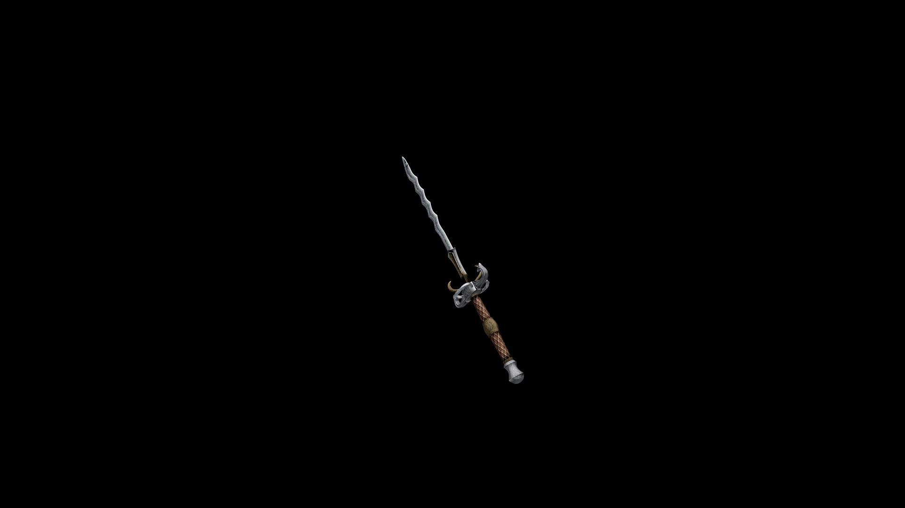

# Steel Long Sword

With a blade forged for serrations, and a crossguard that would make shields look inadequate, this weapon is sure to be a nightmare to anyone on it's business end.

## Item stats

  
Item stats

  <table>
    <tr><th>Weight</th><td>28.2</td></tr>
    <tr><th>Value</th><td>884</td></tr>
    <tr><th>Damage</th><td>12</td></tr>
    <tr><th>Skill</th><td><a href="../../../../Skills/LongBlade/">Long Blade</a></td></tr>
    <tr><th>Damage Type</th><td>Physical</td></tr>
    <tr><th>Holster Slot</th><td>Hip</td></tr>
    <tr><th>Two Handed</th><td>No</td></tr>
    <tr><th>Weapon Set</th><td>Steel</td></tr>
  </table>

