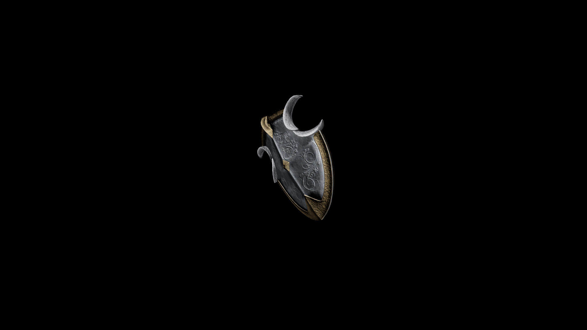

# Steel Shield

Two reinforced cutouts allow for the user versatility in using weapons, and using kinetic force to parry and redirect enemy strikes.

## Item stats
| Weight  | Value | Damage |
|---------|-------|--------|
| 19.7    | 340.0 | 3.5    |