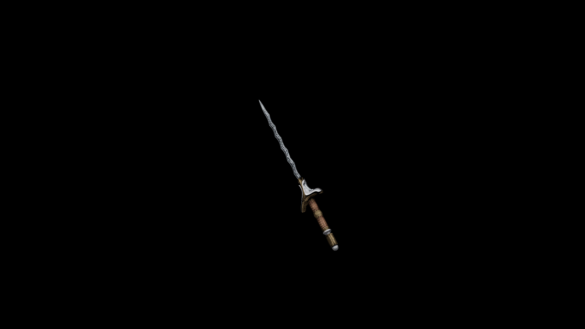

# Steel Short Sword

This blade is more similar to a stiletto than sword. Its cruel, waved blade makes for devastating internal trauma.

## Item stats

  
Item stats

  <table>
    <tr><th>Weight</th><td>10.6</td></tr>
    <tr><th>Value</th><td>229</td></tr>
    <tr><th>Damage</th><td>7</td></tr>
    <tr><th>Skill</th><td><a href="../../../../Skills/ShortBlade/">Short Blade</a></td></tr>
    <tr><th>Damage Type</th><td>Physical</td></tr>
    <tr><th>Holster Slot</th><td>Hip</td></tr>
    <tr><th>Two Handed</th><td>No</td></tr>
    <tr><th>Weapon Set</th><td>Steel</td></tr>
  </table>

