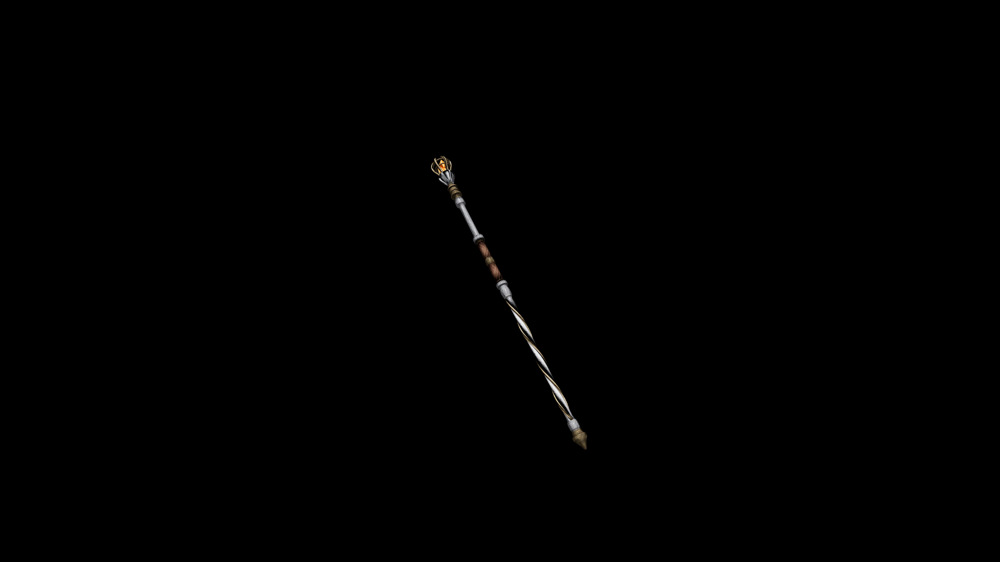

# Steel Staff

A steel basket mounted to the head of this staff holds a cluster of fire quartz. This facsimile of a lit brazier is enough to bend magic into destructive potential.

## Item stats

  
Item stats

  <table>
    <tr><th>Weight</th><td>11.3</td></tr>
    <tr><th>Value</th><td>595</td></tr>
    <tr><th>Damage</th><td>5</td></tr>
    <tr><th>Skill</th><td><a href="../../../../Skills/Staff/">Staff</a></td></tr>
    <tr><th>Damage Type</th><td>Physical</td></tr>
    <tr><th>Holster Slot</th><td>Back</td></tr>
    <tr><th>Two Handed</th><td>No</td></tr>
    <tr><th>Weapon Set</th><td>Steel</td></tr>
  </table>

