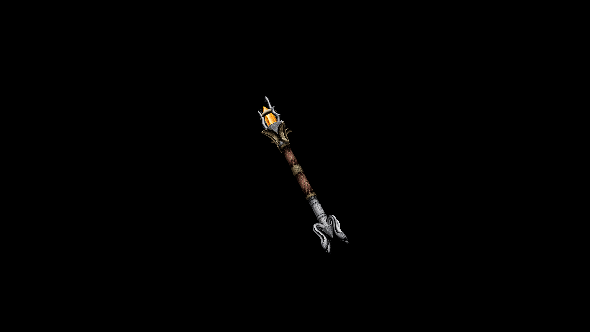

# Steel Wand

The geometric cut of the fire quartz crystal allows seemless integration with the casters magics, allowing for intuitive casting.

## Item stats

  
Item stats

  <table>
    <tr><th>Weight</th><td>1.8</td></tr>
    <tr><th>Value</th><td>340</td></tr>
    <tr><th>Damage</th><td>3</td></tr>
    <tr><th>Skill</th><td><a href="../../../../Skills/Wand/">Wand</a></td></tr>
    <tr><th>Damage Type</th><td>Physical</td></tr>
    <tr><th>Holster Slot</th><td>Hip</td></tr>
    <tr><th>Two Handed</th><td>No</td></tr>
    <tr><th>Weapon Set</th><td>Steel</td></tr>
  </table>

