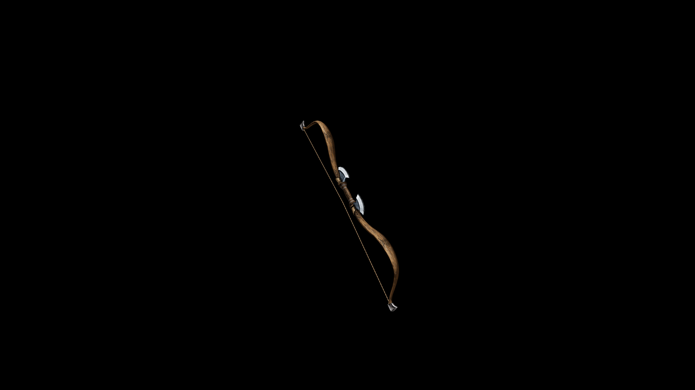

# Usai Bow

The ends of the bow feature ornate carvings or hooks, which are likely to enhance both its aesthetic appeal and its functionality, allowing for a more secure grip.

## Item stats

  
Item stats

  <table>
    <tr><th>Weight</th><td>12.4</td></tr>
    <tr><th>Value</th><td>457</td></tr>
    <tr><th>Damage</th><td>8</td></tr>
    <tr><th>Skill</th><td><a href="../../../../Skills/Marksman/">Marksman</a></td></tr>
    <tr><th>Damage Type</th><td>Physical</td></tr>
    <tr><th>Holster Slot</th><td>Back</td></tr>
    <tr><th>Two Handed</th><td>No</td></tr>
    <tr><th>Weapon Set</th><td>Usai</td></tr>
  </table>

