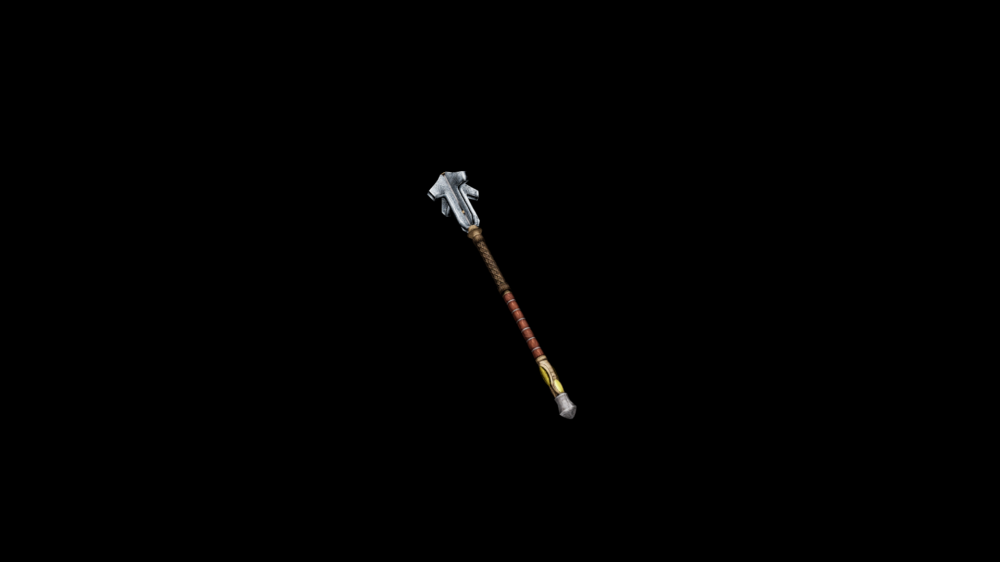

# Usai Club

This weapon's balance between power and control suggests it is meant for striking with great force while still being maneuverable enough for swift attacks.

## Item stats

  
Item stats

  <table>
    <tr><th>Weight</th><td>15.5</td></tr>
    <tr><th>Value</th><td>457</td></tr>
    <tr><th>Damage</th><td>8</td></tr>
    <tr><th>Skill</th><td><a href="../../../../Skills/Blunt/">Blunt</a></td></tr>
    <tr><th>Damage Type</th><td>Physical</td></tr>
    <tr><th>Holster Slot</th><td>Hip</td></tr>
    <tr><th>Two Handed</th><td>No</td></tr>
    <tr><th>Weapon Set</th><td>Usai</td></tr>
  </table>

