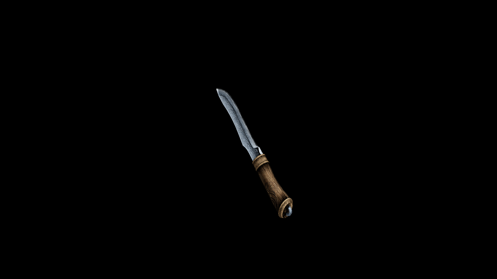

# Usai Dagger

The overall structure of the dagger emphasizes agility and stealth, making it a perfect weapon for swift attacks in tight spaces.

## Item stats

  
Item stats

  <table>
    <tr><th>Weight</th><td>5.4</td></tr>
    <tr><th>Value</th><td>148</td></tr>
    <tr><th>Damage</th><td>4</td></tr>
    <tr><th>Skill</th><td><a href="../../../../Skills/ShortBlade/">Short Blade</a></td></tr>
    <tr><th>Damage Type</th><td>Physical</td></tr>
    <tr><th>Holster Slot</th><td>Hip</td></tr>
    <tr><th>Two Handed</th><td>No</td></tr>
    <tr><th>Weapon Set</th><td>Usai</td></tr>
  </table>

