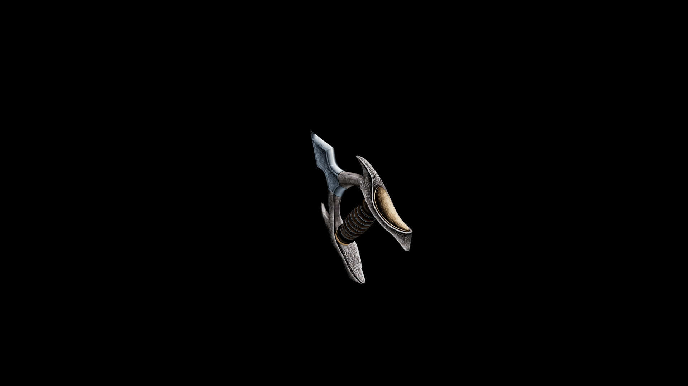

# Usai Knuckles

The grip is designed for maximum comfort and control, allowing for rapid, successive punches, ideal for skilled fighters and those who excel in hand-to-hand combat.

## Item stats

  
Item stats

  <table>
    <tr><th>Weight</th><td>2.7</td></tr>
    <tr><th>Value</th><td>63</td></tr>
    <tr><th>Damage</th><td>6</td></tr>
    <tr><th>Skill</th><td><a href="../../../../Skills/HandToHand/">Hand To Hand</a></td></tr>
    <tr><th>Damage Type</th><td>Physical</td></tr>
    <tr><th>Holster Slot</th><td>Hip</td></tr>
    <tr><th>Two Handed</th><td>No</td></tr>
    <tr><th>Weapon Set</th><td>Usai</td></tr>
  </table>

