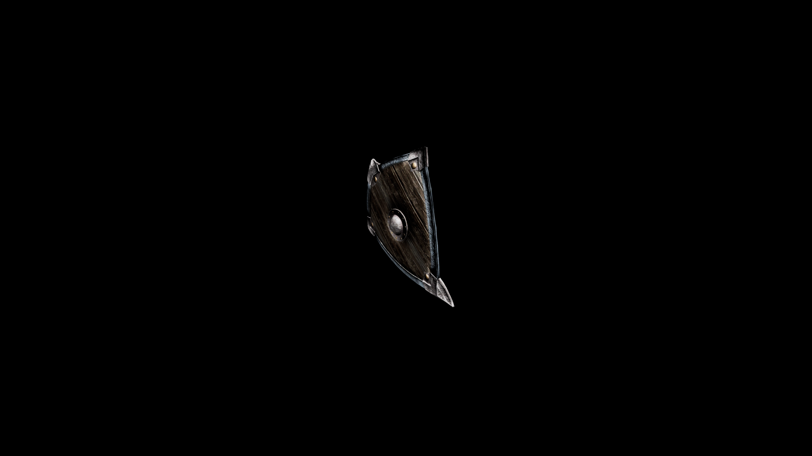

# Usai Shield

The overall aesthetic combines both elegance and functionality, making it a prized piece in the Usai armory.

## Item stats

  
Item stats

  <table>
    <tr><th>Weight</th><td>21.7</td></tr>
    <tr><th>Value</th><td>425</td></tr>
    <tr><th>Damage</th><td>3.5</td></tr>
    <tr><th>Skill</th><td><a href="../../../../Skills/Block/">Block</a></td></tr>
    <tr><th>Damage Type</th><td>Physical</td></tr>
    <tr><th>Holster Slot</th><td>Hip</td></tr>
    <tr><th>Two Handed</th><td>No</td></tr>
    <tr><th>Weapon Set</th><td>Usai</td></tr>
    <tr><th>Shield Type</th><td><a href="../../../../Gameplay/ShieldTypes/#standard-shields">Standard</a></td></tr>
  </table>

