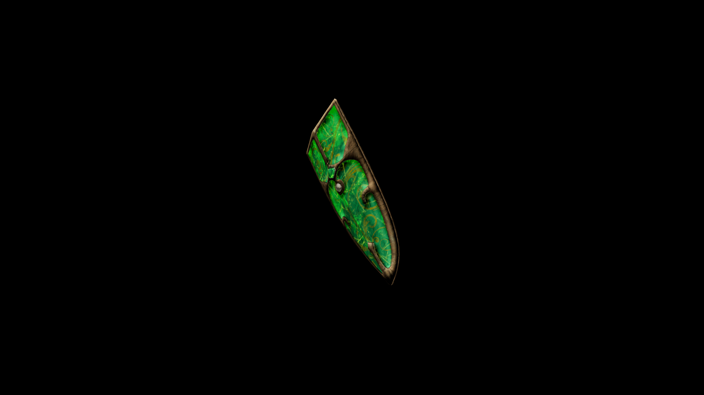

# Viridium Great Shield

It offers massive protection, and when struck, releases a grounding wave that stabilizes the wielder and repels incoming force with elemental resolve.

## Item stats

  
Item stats

  <table>
    <tr><th>Weight</th><td>75.8</td></tr>
    <tr><th>Value</th><td>2041</td></tr>
    <tr><th>Damage</th><td>8.508</td></tr>
    <tr><th>Skill</th><td><a href="../../../../Skills/Block/">Block</a></td></tr>
    <tr><th>Damage Type</th><td>Silver</td></tr>
    <tr><th>Holster Slot</th><td>Hip</td></tr>
    <tr><th>Two Handed</th><td>No</td></tr>
    <tr><th>Weapon Set</th><td>Viridium</td></tr>
    <tr><th>Shield Type</th><td><a href="../../../../Gameplay/ShieldTypes/#great-shields">Great</a></td></tr>
  </table>

