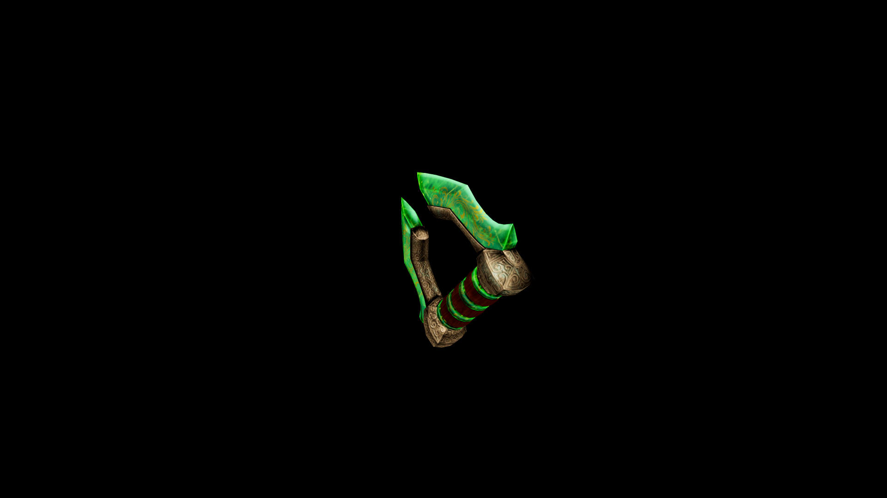

# Viridium Knuckles

Each punch delivers a grounded shock, disrupting enemies’ balance and striking with the strength of stone.

## Item stats

  
Item stats

  <table>
    <tr><th>Weight</th><td>5.1</td></tr>
    <tr><th>Value</th><td>191</td></tr>
    <tr><th>Damage</th><td>14.889</td></tr>
    <tr><th>Skill</th><td><a href="../../../../Skills/HandToHand/">Hand To Hand</a></td></tr>
    <tr><th>Damage Type</th><td>Silver</td></tr>
    <tr><th>Holster Slot</th><td>Hip</td></tr>
    <tr><th>Two Handed</th><td>No</td></tr>
    <tr><th>Weapon Set</th><td>Viridium</td></tr>
  </table>

