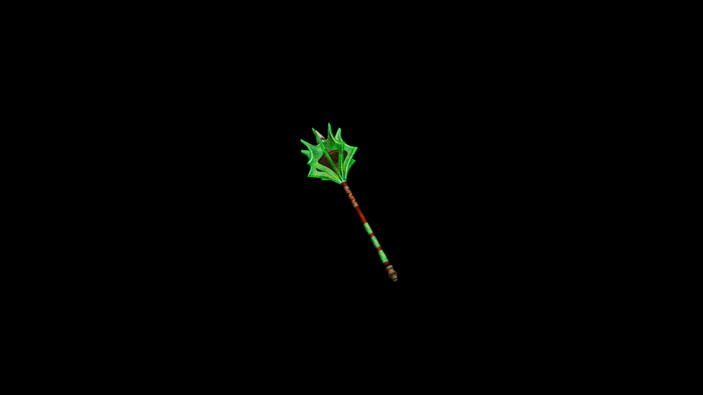

# Viridium Two Handed Mace

A massive, double-handed hammer embedded with glowing veridium along its head.Every swing feels like a tectonic event.

## Item stats

  
Item stats

  <table>
    <tr><th>Weight</th><td>46.7</td></tr>
    <tr><th>Value</th><td>2584</td></tr>
    <tr><th>Damage</th><td>23.397</td></tr>
    <tr><th>Skill</th><td><a href="../../../../Skills/Blunt/">Blunt</a></td></tr>
    <tr><th>Damage Type</th><td>Silver</td></tr>
    <tr><th>Holster Slot</th><td>Hip</td></tr>
    <tr><th>Two Handed</th><td>No</td></tr>
    <tr><th>Weapon Set</th><td>Viridium</td></tr>
  </table>

