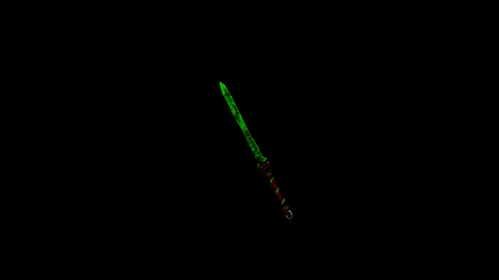

# Viridium Short Sword

Swift and reliable, it’s perfect for close-quarters combat, with each strike delivering a subtle pulse of grounding energy to stagger foes.

## Item stats

  
Item stats

  <table>
    <tr><th>Weight</th><td>21.9</td></tr>
    <tr><th>Value</th><td>861</td></tr>
    <tr><th>Damage</th><td>12.762</td></tr>
    <tr><th>Skill</th><td><a href="../../../../Skills/ShortBlade/">Short Blade</a></td></tr>
    <tr><th>Damage Type</th><td>Silver</td></tr>
    <tr><th>Holster Slot</th><td>Hip</td></tr>
    <tr><th>Two Handed</th><td>No</td></tr>
    <tr><th>Weapon Set</th><td>Viridium</td></tr>
  </table>

