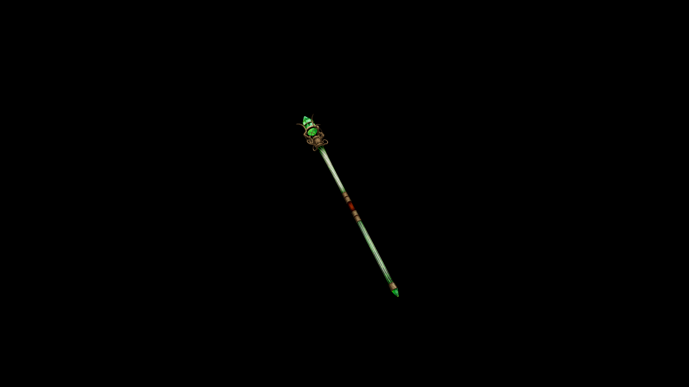

# Viridium Staff

It channels deep, natural magic—amplifying elemental spells and offering a steady connection to the primal forces of the earth.

## Item stats

  
Item stats

  <table>
    <tr><th>Weight</th><td>23.3</td></tr>
    <tr><th>Value</th><td>2233</td></tr>
    <tr><th>Damage</th><td>10.635</td></tr>
    <tr><th>Skill</th><td><a href="../../../../Skills/Staff/">Staff</a></td></tr>
    <tr><th>Damage Type</th><td>Silver</td></tr>
    <tr><th>Holster Slot</th><td>Back</td></tr>
    <tr><th>Two Handed</th><td>No</td></tr>
    <tr><th>Weapon Set</th><td>Viridium</td></tr>
  </table>

