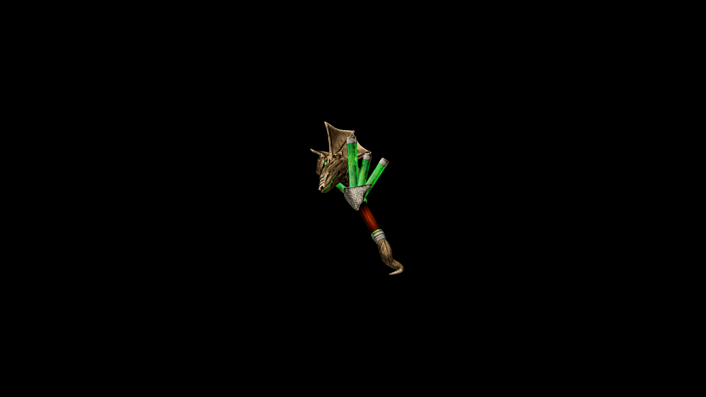

# Viridium Wand

Ideal for focused spellcasting, it sharpens elemental spells and strengthens nature-based incantations with remarkable efficiency.

## Item stats

  
Item stats

  <table>
    <tr><th>Weight</th><td>3.6</td></tr>
    <tr><th>Value</th><td>1276</td></tr>
    <tr><th>Damage</th><td>6.381</td></tr>
    <tr><th>Skill</th><td><a href="../../../../Skills/Wand/">Wand</a></td></tr>
    <tr><th>Damage Type</th><td>Silver</td></tr>
    <tr><th>Holster Slot</th><td>Hip</td></tr>
    <tr><th>Two Handed</th><td>No</td></tr>
    <tr><th>Weapon Set</th><td>Viridium</td></tr>
  </table>

