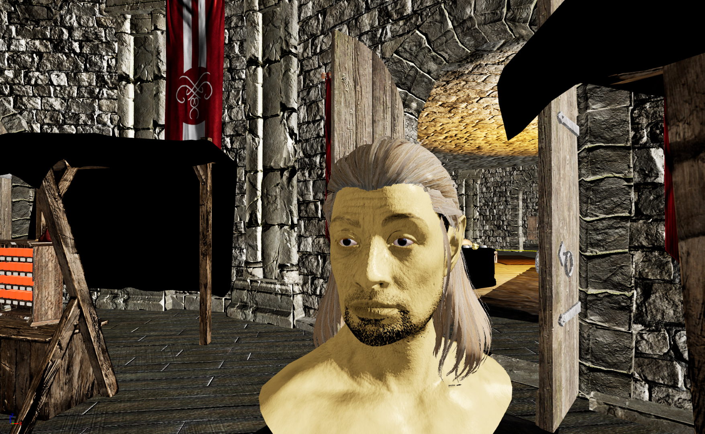

# Kadian

## Quick Jump
* [Base Attributes](#base-attributes)
* [Skill Bonuses](#skill-bonuses)
* [Resistences](#resistences)
* [Other](#other)

#### Information

Learns quickly. Ancient. The oldest civilization in the Empire. Thinks themselves higher than other races. Lives in dry fields. Province controlled by kings. Believes their existence is the result of the God's triumph over chaos. Lives in stone buildings. Has taken and freed other races into slavery throughout their history. Their civilization has come up with most of the modern innovations such as irrigation, chimneys, roads, the court system and the first legal code of laws and consequences, and the modern concept of time in the form of a sundial.

#### Physical Characteristics

*Golden Skin*

*Elf*
## Base Attributes

  
Base Attributes

  <table>
    <tr><th>Strength</th><td>99</td></tr>
    <tr><th>Intelligence</th><td>99</td></tr>
    <tr><th>Willpower</th><td>99</td></tr>
    <tr><th>Speed</th><td>99</td></tr>
    <tr><th>Endurance</th><td>99</td></tr>
    <tr><th>Personality</th><td>99</td></tr>
    <tr><th>Luck</th><td>50</td></tr>
  </table>

## Skill Bonuses

  
Skill Bonuses

  <table>
    <tr><th>Alchemy</th><td>10</td></tr>
    <tr><th>Alteration</th><td>10</td></tr>
    <tr><th>Repair</th><td>10</td></tr>
    <tr><th>Axe</th><td>10</td></tr>
    <tr><th>Block</th><td>10</td></tr>
    <tr><th>Blunt</th><td>10</td></tr>
    <tr><th>Conjuration</th><td>10</td></tr>
    <tr><th>Destruction</th><td>10</td></tr>
  </table>

## Resistences
 - Fire

## Other
- Magic bonus of 100 points